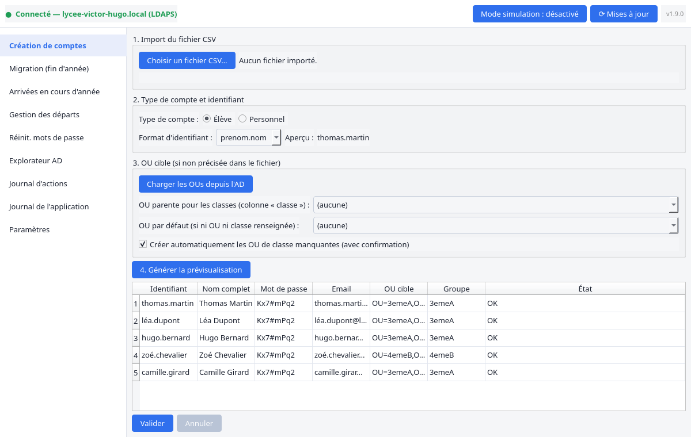
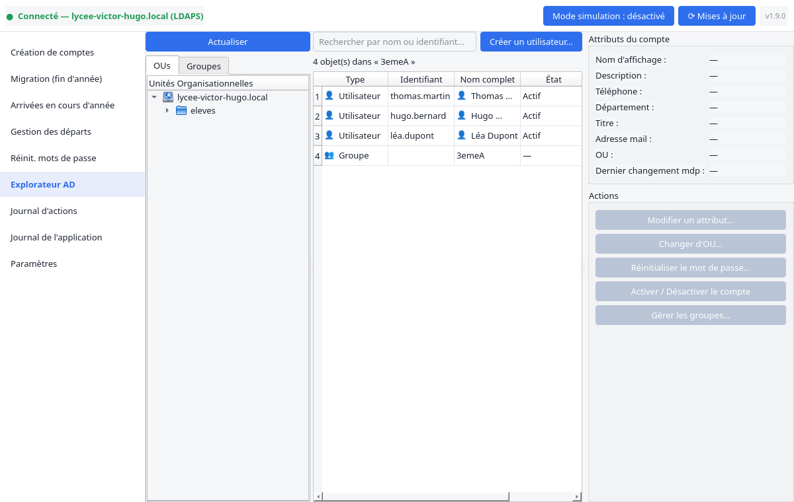
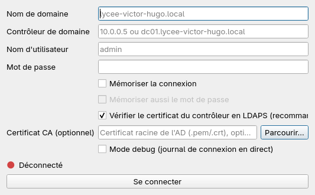

<div align="center">


# EduSync AD

**La gestion des comptes Active Directory de votre établissement, sans jamais ouvrir une console Microsoft.**

Import CSV → comptes créés. Fin d'année → classes migrées. Départ d'un élève → compte archivé. En quelques clics, pas en PowerShell.

📖 [Guide utilisateur](docs/guide_utilisateur.md) · 📥 [Télécharger la dernière version](../../releases/latest)

</div>

---

## En un coup d'œil

<table>
<tr>
<td width="50%">



*Un CSV d'export scolaire (prénom, nom, classe) → identifiants, mots de passe et adresses mail générés automatiquement, doublons résolus tout seuls.*

</td>
<td width="50%">



*Explorateur AD façon RSAT : OUs, groupes, sous-OUs et comptes dans une seule vue — clic droit pour tout modifier, déplacer ou supprimer.*

</td>
</tr>
</table>

<div align="center">


<sub>Connexion LDAPS chiffrée par défaut, avec repli assumé sur LDAP et validation de certificat configurable.</sub>
</div>

---

## Pourquoi EduSync AD

La rentrée, les mutations de fin d'année, les départs d'élèves ou de personnel : ce sont des opérations répétitives, à fort volume, et à fort risque d'erreur quand elles se font à la main dans ADUC. EduSync AD prend en charge le cycle de vie complet d'un compte, du CSV d'inscription à l'archivage, avec :

- **Zéro connaissance AD requise pour l'utiliser au quotidien** — vos fichiers contiennent des prénoms, des noms, des classes. Jamais de `OU=...,DC=...` à taper.
- **Un mode simulation** pour vérifier un import avant d'écrire quoi que ce soit dans l'annuaire.
- **Un journal complet** de chaque action, exportable, pour la traçabilité.
- **Une mise à jour intégrée**, vérifiée par somme de contrôle, qui redémarre l'application toute seule.

---

## Fonctionnalités

| Module | Description |
|--------|-------------|
| **Création de comptes** | Import CSV, génération d'identifiants et mots de passe, gestion des doublons |
| **Migration de classe** | Déplacement en masse entre OUs en fin d'année (via CSV ou interface) |
| **Arrivées en cours d'année** | Création avec vérification des doublons AD existants |
| **Gestion des départs** | Désactivation immédiate ou suppression différée avec archivage |
| **Réinitialisation MDP** | Par OU, par groupe AD ou par fichier CSV |
| **Explorateur AD** | Navigation OUs/groupes/comptes dans une vue unique, actions au clic droit |
| **Journal d'actions** | Historique filtrable et exportable de toutes les opérations |
| **Mode simulation** | Testez tout sans écrire dans l'AD |
| **Mise à jour intégrée** | Vérification, téléchargement et installation depuis l'application, redémarrage automatique |

---

## Téléchargement

Les binaires prêts à l'emploi sont disponibles dans les [**Releases**](../../releases/latest) :

| Plateforme | Fichier | Instructions |
|---|---|---|
| **Windows 10/11** | `EduSyncAD-Setup.exe` | Lancez l'installateur — raccourcis menu Démarrer/Bureau et désinstallation depuis les Paramètres Windows |
| **Linux** | `EduSyncAD-linux.flatpak` | `flatpak install EduSyncAD-linux.flatpak` |

Aucun Python nécessaire.

---

## Connexion

Au lancement, renseignez :
- Nom de domaine (ex. `lycee-victor-hugo.local`)
- Adresse du contrôleur de domaine
- Compte administrateur du domaine

La connexion LDAPS (chiffrée, port 636) est tentée en priorité. Repli automatique sur LDAP (port 389) si indisponible. Si le contrôleur utilise un certificat émis par une autorité interne (cas courant), voir la [section dépannage du guide utilisateur](docs/guide_utilisateur.md#11-dépannage--erreur-de-certificat-ldaps).

---

## Prérequis

- Active Directory accessible sur le réseau
- Compte avec droits de création/modification de comptes utilisateurs

---

## Format des fichiers CSV

Le personnel administratif ne fournit jamais de chemin AD ni d'identifiant de connexion — seulement des prénoms, des noms, et parfois une classe. C'est tout ce qu'EduSync AD demande aussi.

### Création de comptes / Arrivées
```
prenom;nom;classe
Thomas;Martin;3emeA
Léa;Petit;4emeB
```
Seuls `prenom` et `nom` sont obligatoires. La classe est résolue automatiquement vers la bonne OU (réglage "OU parente pour les classes" dans les Paramètres, ou racine du domaine par défaut). Un chemin AD complet (`ou`) reste accepté pour les cas avancés — voir le [guide utilisateur](docs/guide_utilisateur.md).

### Migration (fin d'année)
```
prenom;nom;classe_source;classe_destination
Thomas;Martin;4emeA;3emeA
```

### Départs
```
prenom;nom
Thomas;Martin
```
Un identifiant AD direct reste accepté (colonne `identifiant`), prioritaire s'il est présent.

### Réinitialisation de mot de passe
```
prenom;nom
Thomas;Martin
```
Colonne `identifiant`/`login`/`sam` également acceptée.

Des exemples sont disponibles dans le dossier [`exemples/`](exemples/).

---

## Build depuis les sources

```bash
git clone <url-du-depot>
cd EduSync-AD
python -m venv .venv && source .venv/bin/activate  # Windows : .venv\Scripts\activate
pip install -e ".[dev]"
python src/edusync_ad/app.py
```

**Build Windows (.exe) :**
```bash
pip install pyinstaller cairosvg pillow
python tools/generate_icon.py
pyinstaller packaging/edusync_ad.spec
# → dist/EduSyncAD/EduSyncAD.exe
```

**Tests :**
```bash
pytest
```

---

## Licence

MIT
